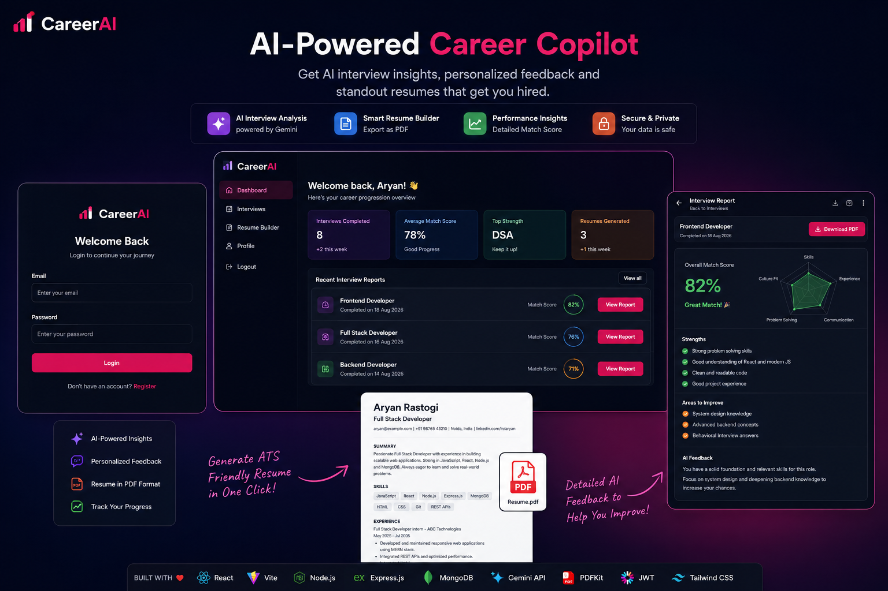
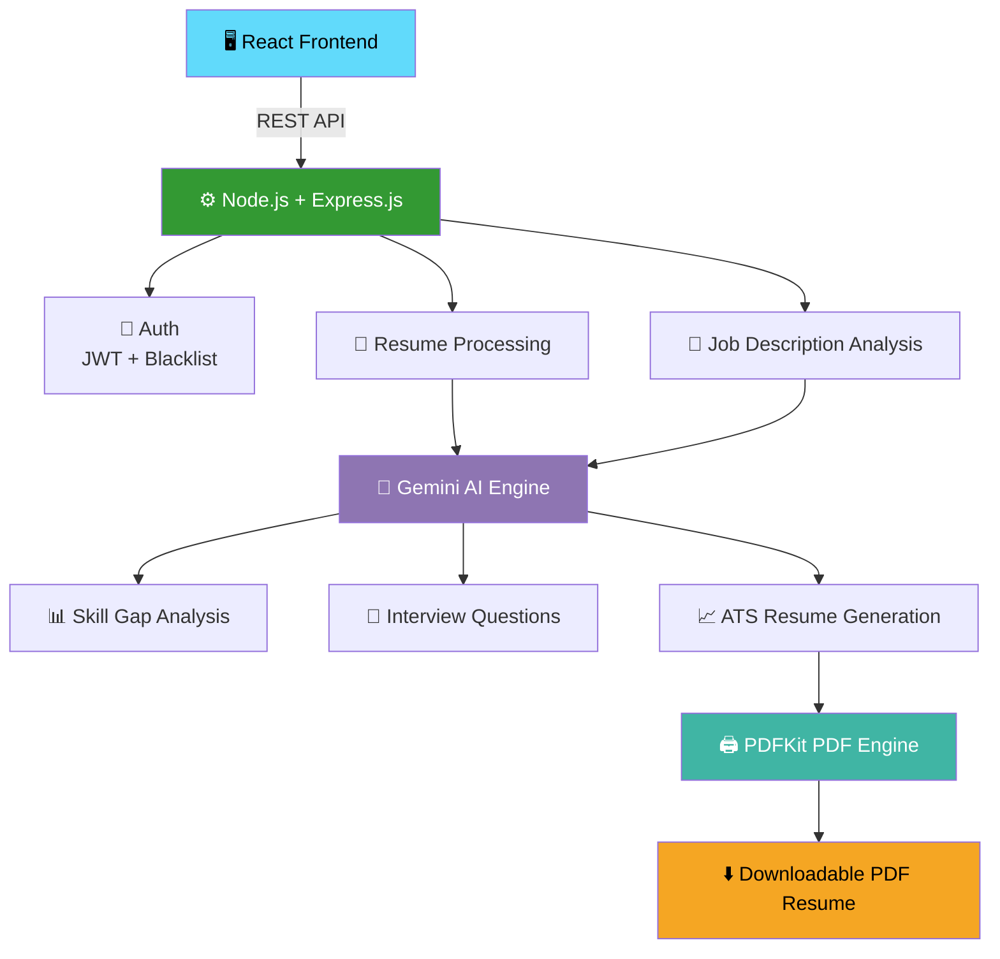
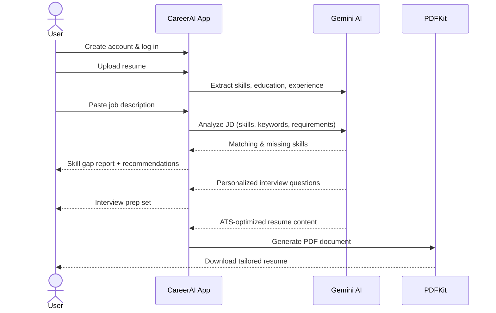
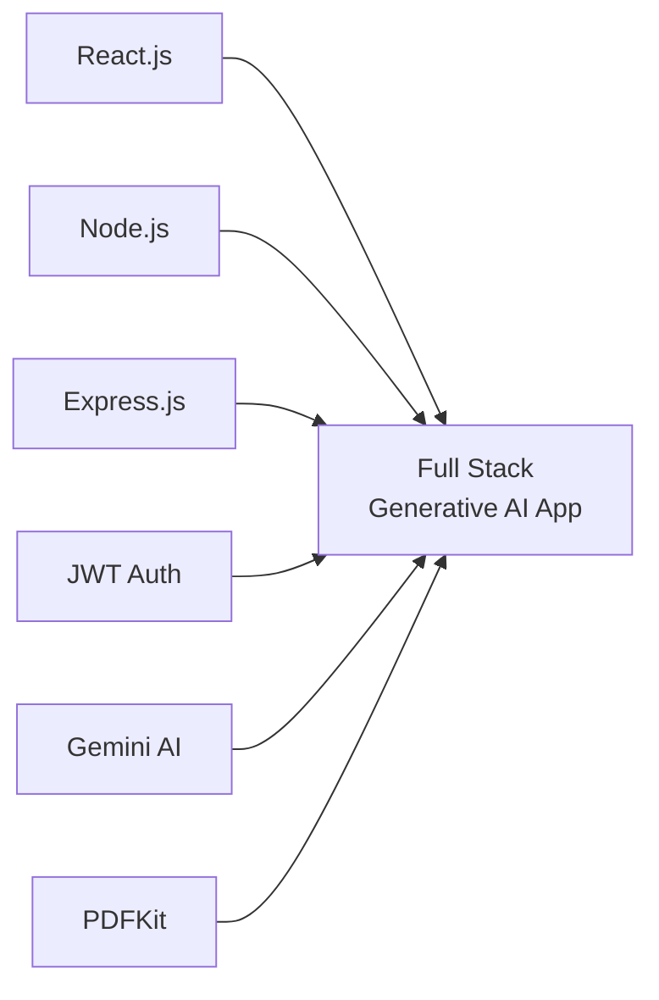

<div align="center">

# 🚀 CareerAI

### 🧬 Generative AI Project — AI-Powered Job Preparation & Resume Intelligence Platform

[](https://ai.google.dev/)
[](https://react.dev/)
[](https://nodejs.org/)
[](https://expressjs.com/)
[](https://ai.google.dev/)
[](https://jwt.io/)
[](https://pdfkit.org/)

[](LICENSE)
[](https://github.com/aryanvisualize/CareerAI/pulls)
[](https://github.com/aryanvisualize/CareerAI/stargazers)
[](https://github.com/aryanvisualize/CareerAI/issues)
[](https://github.com/aryanvisualize/CareerAI/commits/main)

[**Live Demo**](#) · [**Report Bug**](https://github.com/aryanvisualize/CareerAI/issues) · [**Request Feature**](https://github.com/aryanvisualize/CareerAI/issues)

</div>

<br>

<div align="center">

</div>

<br>

## 📋 Table of Contents

<details open>
<summary>Click to expand/collapse</summary>

- [Overview](#-overview)
- [Features](#-features)
- [Architecture](#️-architecture)
- [Tech Stack](#️-tech-stack)
- [Application Workflow](#-application-workflow)
- [Project Structure](#-project-structure)
- [Getting Started](#-getting-started)
- [Environment Variables](#️-environment-variables)
- [API Reference](#-api-reference)
- [Security](#️-security-considerations)
- [Roadmap](#-roadmap)
- [Contributing](#-contributing)
- [License](#-license)
- [Author](#-author)

</details>

---

## 🌟 Overview

**CareerAI is a Generative AI project** — a production-ready, Full Stack GenAI web application that helps job seekers prepare smarter. It uses **Google Gemini** as its generative intelligence layer to analyze resumes, identify skill gaps against target job descriptions, optimize resumes for ATS systems, and generate personalized AI-powered interview questions — all in one platform.

Built with **React.js, Node.js, Express.js, JWT, Google Gemini AI, and PDFKit**, CareerAI simulates a real-world SaaS product combining secure authentication, document processing, generative AI integration, and dynamic PDF generation.

> **One platform. One resume. One target job. Smarter preparation.**

---

## ✨ Features

<table>
<tr>
<td width="50%" valign="top">

### 🔐 Secure Authentication
- User registration and login
- JWT-based authentication
- Secure protected routes
- JWT token blacklisting
- Logout and session invalidation
- Middleware-based authorization

### 📄 Resume Processing
- Upload resumes through the web app
- Parse resume content
- Extract skills, experience, education
- Convert unstructured data into structured JSON

### 🎯 Job Description Analysis
- AI-driven job description parsing
- Extract required skills and qualifications
- Identify important keywords
- Compare job requirements with candidate skills

</td>
<td width="50%" valign="top">

### 🧠 AI-Powered Skill Gap Detection
- Compare resume skills vs. job requirements
- Identify missing or weak skills
- Highlight areas needing improvement
- Actionable preparation recommendations

### 🤖 AI Interview Preparation
- Personalized interview question generation
- Based on resume, JD, skills & gaps
- Technical + behavioral question support

### 📈 ATS-Optimized Resume Generation
- AI-generated, keyword-optimized content
- Job-specific resume versions
- Programmatic PDF generation via PDFKit

</td>
</tr>
</table>

---

## 🏗️ Architecture



---

## 🛠️ Tech Stack

| Layer | Technologies |
|---|---|
| **Frontend** | React.js, JavaScript, HTML5, CSS3, REST API integration |
| **Backend** | Node.js, Express.js, RESTful APIs, Middleware architecture |
| **Authentication** | JSON Web Token (JWT), Token blacklisting, Protected routes |
| **Artificial Intelligence** | Google Gemini API — resume analysis, skill extraction, JD analysis, interview generation, ATS optimization |
| **PDF Generation** | PDFKit — programmatic, code-driven PDF generation |

---

## 🔄 Application Workflow



<details>
<summary><b>📊 Skill Gap Analysis — detail view</b></summary>

```text
   Candidate Skills          Job Requirements
          │                         │
          └───────────┬─────────────┘
                       ▼
                  AI Analysis
                       ▼
        ┌───────────────────────────┐
        │      Matching Skills      │
        │      Missing Skills       │
        │      Recommendations      │
        └───────────────────────────┘
```

</details>

---

## 📂 Project Structure

```text
CareerAI/
│
├── client/                  # React frontend
│   ├── public/
│   └── src/
│       ├── components/
│       ├── pages/
│       ├── services/
│       ├── hooks/
│       ├── utils/
│       └── App.jsx
│
├── server/                  # Node.js / Express backend
│   ├── controllers/
│   ├── middleware/
│   ├── routes/
│   ├── services/
│   ├── utils/
│   ├── models/
│   └── server.js
│
├── uploads/                 # Uploaded resume storage
│
├── .env
├── .gitignore
├── package.json
└── README.md
```

> The exact folder structure may vary depending on your implementation.

---

## 🚀 Getting Started

### Prerequisites

- [Node.js](https://nodejs.org/) & npm
- [Git](https://git-scm.com/)
- A **Gemini API key**
- A supported database (if used by your implementation)

<details>
<summary><b>1️⃣ Clone the repository</b></summary>

```bash
git clone https://github.com/aryanvisualize/CareerAI.git
cd CareerAI
```

</details>

<details>
<summary><b>2️⃣ Install backend dependencies</b></summary>

```bash
cd server
npm install
```

</details>

<details>
<summary><b>3️⃣ Configure environment variables</b></summary>

Create a `.env` file inside `server/` — see [Environment Variables](#️-environment-variables) below.

</details>

<details>
<summary><b>4️⃣ Start the backend</b></summary>

```bash
npm run dev
```

</details>

<details>
<summary><b>5️⃣ Install frontend dependencies</b></summary>

```bash
cd client
npm install
```

</details>

<details>
<summary><b>6️⃣ Start the frontend</b></summary>

```bash
npm run dev
```

The app will be available at the local development URL shown in your terminal.

</details>

---

## ⚙️ Environment Variables

Create a `.env` file inside the `server/` directory:

```env
PORT=5000

JWT_SECRET=your_jwt_secret

GEMINI_API_KEY=your_gemini_api_key

# Add your database configuration if required
DATABASE_URL=your_database_url
```

> ⚠️ **Never commit your `.env` file or API keys to GitHub.**

---

## 🔌 API Reference

<details>
<summary><b>Expand full endpoint list</b></summary>

```text
/api/auth
    POST /register
    POST /login
    POST /logout

/api/resume
    POST /upload
    POST /analyze
    POST /generate

/api/jobs
    POST /analyze

/api/skills
    POST /gap-analysis

/api/interview
    POST /generate

/api/pdf
    POST /generate
```

> Exact endpoints depend on your implementation.

</details>

---

## 🛡️ Security Considerations

| Consideration | Implementation |
|---|---|
| Authentication | JWT-based, with protected routes |
| Session control | Token blacklisting on logout |
| Secrets management | Environment variables (`.env`) |
| Input validation | Sanitized request payloads |
| File uploads | Controlled, validated upload handling |
| Error handling | Centralized error middleware |
| Logging | No sensitive data in logs |

---

## 📌 Roadmap

- [ ] 🔎 Job search and job recommendations
- [ ] 📊 Resume ATS scoring
- [ ] 💼 LinkedIn profile analysis
- [ ] 🎤 AI voice interview simulation
- [ ] 🗣️ Real-time interview conversations
- [ ] 📈 Interview performance analytics
- [ ] 🧑‍💼 Personalized career roadmap
- [ ] 📚 AI-generated learning plans
- [ ] 🔔 Job application tracking
- [ ] 🌐 Multi-language resume generation
- [ ] ☁️ Cloud file storage
- [ ] 📱 Mobile-responsive improvements
- [ ] 👥 Recruiter/company dashboard

---


## 🎯 Project Goals & Learning Outcomes

CareerAI is a **Generative AI project** built to demonstrate how modern web technologies and GenAI can combine into a practical, production-style application — covering full stack development, REST API design, JWT authorization, generative AI API integration, NLP, prompt engineering, and PDF automation.



---

## 🤝 Contributing

Contributions are welcome! To contribute:

1. Fork the repository
2. Create your feature branch (`git checkout -b feature/AmazingFeature`)
3. Commit your changes (`git commit -m 'Add some AmazingFeature'`)
4. Push to the branch (`git push origin feature/AmazingFeature`)
5. Open a Pull Request

---

## 👨‍💻 Author

**Aryan**
Full Stack Developer · AI/ML Enthusiast

GitHub: [github.com/aryanvisualize](https://github.com/aryanvisualize) · LinkedIn: [linkedin.com/in/aryan-rastogi-dev](https://www.linkedin.com/in/aryan-rastogi-dev/)

---

<div align="center">

### ⭐ If you found this project useful, consider giving it a star!

**A Generative AI project built with ❤️ using React, Node.js, Express.js, Gemini AI, JWT, and PDFKit.**

</div>